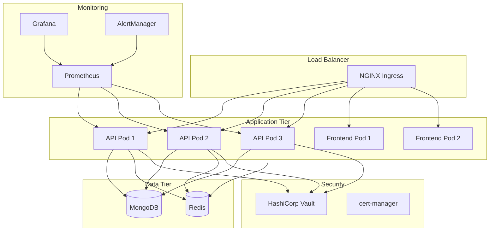
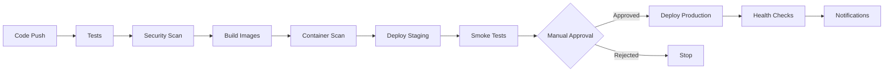

# Infra Mind - Production Deployment

[](https://github.com/your-org/infra-mind/actions/workflows/ci-cd.yml)
[](https://github.com/your-org/infra-mind/actions/workflows/security-scan.yml)
[](LICENSE)

Enterprise-grade production deployment configuration for Infra Mind, featuring Kubernetes orchestration, advanced CI/CD pipelines, and comprehensive security measures.

## 🚀 Quick Start

### Prerequisites
- Kubernetes cluster (v1.25+)
- kubectl configured
- Docker (v20.10+)
- Helm (v3.10+)

### Deploy to Staging
```bash
# Clone repository
git clone https://github.com/your-org/infra-mind.git
cd infra-mind

# Deploy to staging
make deploy-staging
```

### Deploy to Production
```bash
# Deploy to production (requires approval)
make deploy-production
```

## 📋 Table of Contents

- [Architecture Overview](#architecture-overview)
- [Deployment Options](#deployment-options)
- [CI/CD Pipeline](#cicd-pipeline)
- [Security Features](#security-features)
- [Monitoring & Observability](#monitoring--observability)
- [Scaling & Performance](#scaling--performance)
- [Backup & Recovery](#backup--recovery)
- [Troubleshooting](#troubleshooting)
- [Contributing](#contributing)

## 🏗️ Architecture Overview

### Production Architecture



### Key Components

| Component | Purpose | Replicas | Resources |
|-----------|---------|----------|-----------|
| **API Pods** | FastAPI application with multi-agent system | 3-20 (HPA) | 1-4 GB RAM, 0.5-2 CPU |
| **Frontend Pods** | Next.js React application | 2-10 (HPA) | 256MB-1GB RAM, 0.1-0.5 CPU |
| **MongoDB** | Primary database for assessments and reports | 1 (3 in HA) | 2-8 GB RAM, 0.25-1 CPU |
| **Redis** | Caching and session storage | 1 (3 in HA) | 1-4 GB RAM, 0.1-0.5 CPU |
| **NGINX Ingress** | Load balancer and SSL termination | 2-3 | 512MB RAM, 0.2 CPU |

## 🚢 Deployment Options

### Option 1: Automated CI/CD (Recommended)

**GitHub Actions Pipeline:**
1. Push to `develop` → Deploy to staging
2. Push to `main` → Deploy to production (with approval)

```bash
# Trigger staging deployment
git push origin develop

# Trigger production deployment
git push origin main
```

### Option 2: Manual Deployment

**Using Make commands:**
```bash
# Build and test
make build test

# Deploy to staging
make deploy-staging

# Deploy to production
make deploy-production
```

**Using deployment script:**
```bash
# Deploy to staging
./scripts/deploy-k8s.sh staging deploy

# Deploy to production
./scripts/deploy-k8s.sh production deploy
```

### Option 3: Helm Chart (Advanced)

```bash
# Install with Helm
helm install infra-mind ./helm/infra-mind \
  --namespace infra-mind \
  --create-namespace \
  --values values-production.yaml
```

## 🔄 CI/CD Pipeline

### Pipeline Stages



### Environments

| Environment | Branch | Auto-Deploy | Approval Required |
|-------------|--------|-------------|-------------------|
| **Staging** | `develop` | ✅ Yes | ❌ No |
| **Production** | `main` | ❌ No | ✅ Yes (2 reviewers) |

### Quality Gates

- ✅ Unit tests (>90% coverage)
- ✅ Integration tests
- ✅ Security scans (Trivy, CodeQL, Snyk)
- ✅ Performance tests
- ✅ Code quality (Black, Flake8, ESLint)
- ✅ Container vulnerability scan
- ✅ Infrastructure security scan

## 🔒 Security Features

### Multi-Layer Security

#### 1. **Secrets Management**
- **HashiCorp Vault** integration
- **External Secrets Operator** for K8s
- **Cloud provider secret managers** (AWS/Azure/GCP)
- **Sealed Secrets** for GitOps workflows

#### 2. **Network Security**
- **Network policies** for pod-to-pod communication
- **TLS 1.3** encryption for all traffic
- **WAF** protection via ingress
- **Rate limiting** and DDoS protection

#### 3. **Container Security**
- **Non-root containers** with security contexts
- **Read-only root filesystems**
- **Resource limits** and quotas
- **Pod Security Standards** (restricted)

#### 4. **Authentication & Authorization**
- **JWT-based authentication**
- **RBAC** for Kubernetes resources
- **Service accounts** with minimal permissions
- **Multi-factor authentication** support

#### 5. **Compliance**
- **SOC 2 Type II** ready
- **GDPR** compliance features
- **HIPAA** compliance options
- **Audit logging** for all operations

### Security Scanning

```bash
# Run comprehensive security scan
make security-scan

# Run security audit
make security-audit
```

## 📊 Monitoring & Observability

### Monitoring Stack

- **Prometheus** - Metrics collection
- **Grafana** - Visualization and dashboards
- **AlertManager** - Alert routing and management
- **Jaeger** - Distributed tracing
- **ELK Stack** - Centralized logging

### Key Metrics

#### Application Metrics
- Request duration (p50, p95, p99)
- Error rates by endpoint
- Agent execution times
- Database query performance
- Cache hit/miss ratios

#### Infrastructure Metrics
- CPU and memory utilization
- Network I/O and latency
- Disk usage and IOPS
- Pod restart counts
- Node health status

#### Business Metrics
- Assessment completion rates
- User engagement metrics
- Recommendation accuracy scores
- Cost optimization savings

### Dashboards

```bash
# Access Grafana dashboard
make monitoring-dashboard

# View application logs
make k8s-logs

# Check deployment status
make deploy-status
```

### Alerting Rules

| Alert | Condition | Severity | Action |
|-------|-----------|----------|--------|
| High Error Rate | >5% errors for 5min | Critical | Page on-call |
| High Latency | p95 >2s for 10min | Warning | Slack notification |
| Pod Crashes | >3 restarts in 15min | Critical | Auto-scale + alert |
| Database Down | Connection failures | Critical | Page on-call |
| Disk Space Low | >85% usage | Warning | Slack notification |

## ⚡ Scaling & Performance

### Horizontal Pod Autoscaler (HPA)

```yaml
# API scaling configuration
minReplicas: 3
maxReplicas: 20
targetCPUUtilization: 70%
targetMemoryUtilization: 80%
```

### Vertical Pod Autoscaler (VPA)

```yaml
# Automatic resource optimization
updateMode: "Auto"
minAllowed:
  cpu: 250m
  memory: 512Mi
maxAllowed:
  cpu: 2000m
  memory: 4Gi
```

### Performance Optimization

#### Database Optimization
- **Connection pooling** (10-50 connections)
- **Query optimization** with proper indexing
- **Read replicas** for scaling reads
- **Caching strategy** with Redis

#### Application Optimization
- **Async processing** for long-running tasks
- **Connection pooling** for external APIs
- **Response caching** for frequently accessed data
- **CDN integration** for static assets

#### Infrastructure Optimization
- **Node auto-scaling** based on demand
- **Spot instances** for cost optimization
- **Multi-AZ deployment** for high availability
- **SSD storage** for database workloads

### Performance Testing

```bash
# Run performance tests
make performance-test

# Run load tests against staging
make load-test

# Monitor performance metrics
kubectl port-forward service/prometheus-server 9090:80 -n monitoring
```

## 💾 Backup & Recovery

### Backup Strategy

#### Database Backups
- **Frequency**: Daily full, hourly incremental
- **Retention**: 30 days local, 90 days remote
- **Encryption**: AES-256 at rest and in transit
- **Testing**: Weekly restore tests

#### Application Backups
- **Configuration**: GitOps with version control
- **Secrets**: Encrypted backup to secure storage
- **Persistent volumes**: Daily snapshots
- **Container images**: Multi-region registry

### Disaster Recovery

| Metric | Target | Strategy |
|--------|--------|----------|
| **RTO** | 4 hours | Automated failover + manual intervention |
| **RPO** | 1 hour | Continuous replication + hourly backups |
| **Availability** | 99.9% | Multi-AZ deployment + health checks |

### Recovery Procedures

```bash
# Create database backup
make db-backup

# Restore from backup
make db-restore

# Rollback deployment
make deploy-rollback
```

## 🔧 Troubleshooting

### Common Issues

#### 1. **Pod Startup Failures**
```bash
# Check pod status and logs
kubectl get pods -n infra-mind
kubectl logs -f deployment/infra-mind-api -n infra-mind
kubectl describe pod <pod-name> -n infra-mind
```

#### 2. **Database Connection Issues**
```bash
# Test database connectivity
make db-shell
kubectl exec -it deployment/mongodb -n infra-mind -- mongosh
```

#### 3. **Performance Issues**
```bash
# Check resource usage
kubectl top pods -n infra-mind
kubectl top nodes

# Check HPA status
kubectl get hpa -n infra-mind
```

#### 4. **SSL/TLS Issues**
```bash
# Check certificate status
kubectl describe certificate infra-mind-tls -n infra-mind
kubectl get certificaterequests -n infra-mind
```

### Debug Commands

```bash
# Get shell access to API pod
make k8s-shell

# Port forward for local debugging
make k8s-port-forward

# View comprehensive logs
make k8s-logs

# Check deployment status
make deploy-status
```

### Emergency Procedures

#### 1. **Scale Down for Maintenance**
```bash
kubectl scale deployment infra-mind-api --replicas=0 -n infra-mind
kubectl scale deployment infra-mind-frontend --replicas=0 -n infra-mind
```

#### 2. **Emergency Rollback**
```bash
make deploy-rollback ENVIRONMENT=production
```

#### 3. **Database Emergency Recovery**
```bash
# Stop application
kubectl scale deployment infra-mind-api --replicas=0 -n infra-mind

# Restore database
make db-restore

# Restart application
kubectl scale deployment infra-mind-api --replicas=3 -n infra-mind
```

## 🤝 Contributing

### Development Workflow

1. **Fork** the repository
2. **Create** a feature branch (`git checkout -b feature/amazing-feature`)
3. **Make** your changes
4. **Test** your changes (`make test`)
5. **Commit** your changes (`git commit -m 'Add amazing feature'`)
6. **Push** to the branch (`git push origin feature/amazing-feature`)
7. **Open** a Pull Request

### Code Standards

- **Python**: Black formatting, Flake8 linting, MyPy type checking
- **TypeScript**: ESLint + Prettier, strict type checking
- **Tests**: >90% coverage required
- **Documentation**: Update docs for any API changes

### Review Process

- **Automated checks** must pass
- **Security scan** must pass
- **2 reviewers** required for production changes
- **1 reviewer** required for staging changes

## 📞 Support

### Getting Help

- **Documentation**: [docs/PRODUCTION_DEPLOYMENT.md](docs/PRODUCTION_DEPLOYMENT.md)
- **Issues**: [GitHub Issues](https://github.com/your-org/infra-mind/issues)
- **Discussions**: [GitHub Discussions](https://github.com/your-org/infra-mind/discussions)
- **Security**: security@infra-mind.com

### Monitoring & Alerts

- **Status Page**: https://status.infra-mind.com
- **Grafana**: https://monitoring.infra-mind.com
- **Slack**: #infra-mind-alerts

## 📄 License

This project is licensed under the MIT License - see the [LICENSE](LICENSE) file for details.

## 🙏 Acknowledgments

- **Kubernetes Community** for the orchestration platform
- **CNCF Projects** for the cloud-native ecosystem
- **Open Source Contributors** for the amazing tools and libraries

---

**Built with ❤️ by the Infra Mind Team**

For more detailed information, see our [comprehensive deployment guide](docs/PRODUCTION_DEPLOYMENT.md).