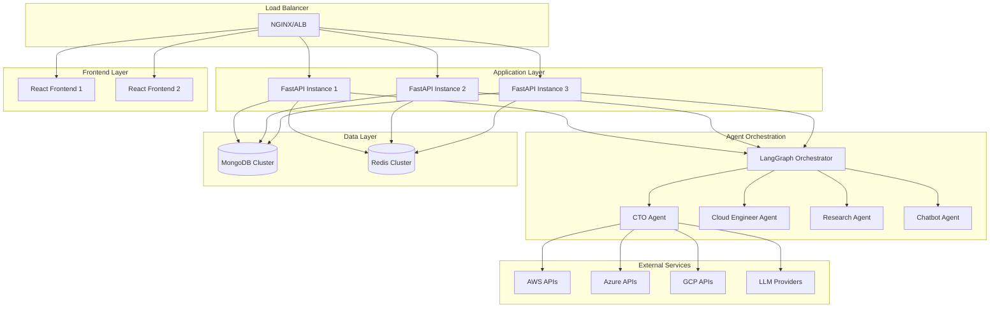

# Production Operations Guide

## Overview

This guide provides comprehensive documentation for operating the Infra Mind platform in production environments. It covers all aspects of system administration, monitoring, troubleshooting, and maintenance procedures.

## Table of Contents

1. [System Architecture](#system-architecture)
2. [Configuration Management](#configuration-management)
3. [Deployment Procedures](#deployment-procedures)
4. [Monitoring and Alerting](#monitoring-and-alerting)
5. [Troubleshooting Guide](#troubleshooting-guide)
6. [Maintenance Procedures](#maintenance-procedures)
7. [Security Operations](#security-operations)
8. [Backup and Recovery](#backup-and-recovery)
9. [Performance Optimization](#performance-optimization)
10. [Incident Response](#incident-response)

## System Architecture

### Production Components



### Key Production Services

- **API Gateway**: FastAPI with multiple instances behind load balancer
- **Frontend**: React application served via CDN/static hosting
- **Agent Orchestration**: LangGraph-based multi-agent system
- **Database**: MongoDB replica set with automatic failover
- **Cache**: Redis cluster with high availability
- **External Integrations**: Real cloud provider APIs and LLM services

## Configuration Management

### Environment Variables

Production configuration is managed through environment variables and secrets:

```bash
# Core Application
ENVIRONMENT=production
DEBUG=false
LOG_LEVEL=INFO

# Database Configuration
MONGODB_URL=mongodb://mongo-cluster:27017/infra_mind_prod
REDIS_URL=redis://redis-cluster:6379/0

# API Keys (stored in secrets management)
AWS_ACCESS_KEY_ID=${AWS_ACCESS_KEY_ID}
AWS_SECRET_ACCESS_KEY=${AWS_SECRET_ACCESS_KEY}
AZURE_CLIENT_ID=${AZURE_CLIENT_ID}
AZURE_CLIENT_SECRET=${AZURE_CLIENT_SECRET}
GCP_SERVICE_ACCOUNT_KEY=${GCP_SERVICE_ACCOUNT_KEY}
OPENAI_API_KEY=${OPENAI_API_KEY}
ANTHROPIC_API_KEY=${ANTHROPIC_API_KEY}

# Security
JWT_SECRET_KEY=${JWT_SECRET_KEY}
ENCRYPTION_KEY=${ENCRYPTION_KEY}

# Monitoring
PROMETHEUS_ENDPOINT=http://prometheus:9090
GRAFANA_ENDPOINT=http://grafana:3000
```

### Configuration Files

Key configuration files and their locations:

- `/app/config/production.yaml` - Main application configuration
- `/app/config/agents.yaml` - Agent-specific settings
- `/app/config/integrations.yaml` - External service configurations
- `/etc/nginx/nginx.conf` - Load balancer configuration
- `/etc/mongodb/mongod.conf` - Database configuration
- `/etc/redis/redis.conf` - Cache configuration

## Deployment Procedures

### Standard Deployment Process

1. **Pre-deployment Checks**
   ```bash
   # Verify system health
   ./scripts/health-check.sh
   
   # Run integration tests
   python -m pytest tests/test_integration.py
   
   # Validate configuration
   python scripts/validate-config.py
   ```

2. **Database Migration**
   ```bash
   # Backup current database
   python scripts/backup_restore.py --backup
   
   # Run migrations
   python scripts/migrate_data.py --environment=production
   
   # Validate migration
   python scripts/validate_data.py
   ```

3. **Application Deployment**
   ```bash
   # Build production images
   ./scripts/build-production.sh
   
   # Deploy to Kubernetes
   ./scripts/deploy-k8s.sh production
   
   # Verify deployment
   kubectl get pods -n infra-mind-prod
   ```

4. **Post-deployment Verification**
   ```bash
   # Health check
   curl -f http://api.infra-mind.com/health
   
   # Smoke tests
   python tests/test_smoke.py
   
   # Monitor metrics
   # Check Grafana dashboards for anomalies
   ```

### Rollback Procedures

If deployment issues occur:

1. **Immediate Rollback**
   ```bash
   # Rollback Kubernetes deployment
   kubectl rollout undo deployment/infra-mind-api -n infra-mind-prod
   
   # Restore database if needed
   python scripts/backup_restore.py --restore --backup-id=<backup_id>
   ```

2. **Verification**
   ```bash
   # Verify rollback success
   ./scripts/health-check.sh
   
   # Check application logs
   kubectl logs -f deployment/infra-mind-api -n infra-mind-prod
   ```

## Monitoring and Alerting

### Key Metrics to Monitor

1. **Application Metrics**
   - API response times (< 2s for 95th percentile)
   - Error rates (< 1% for 4xx, < 0.1% for 5xx)
   - Agent execution success rate (> 95%)
   - LLM API success rate (> 98%)

2. **Infrastructure Metrics**
   - CPU utilization (< 80% average)
   - Memory usage (< 85% average)
   - Disk usage (< 80% for all volumes)
   - Network latency (< 100ms to external APIs)

3. **Business Metrics**
   - Assessment completion rate
   - User session duration
   - Report generation success rate
   - Customer satisfaction scores

### Alert Thresholds

Critical alerts (immediate response required):
- API error rate > 5%
- Database connection failures
- Agent orchestration failures
- Security incidents

Warning alerts (response within 1 hour):
- High response times (> 5s)
- Resource utilization > 85%
- External API rate limiting
- Cache hit rate < 80%

### Monitoring Tools

- **Prometheus**: Metrics collection and alerting
- **Grafana**: Visualization and dashboards
- **ELK Stack**: Log aggregation and analysis
- **Jaeger**: Distributed tracing
- **PagerDuty**: Alert management and escalation

## Troubleshooting Guide

### Common Issues and Solutions

#### 1. High API Response Times

**Symptoms:**
- API responses > 5 seconds
- User complaints about slow performance
- High CPU/memory usage

**Diagnosis:**
```bash
# Check API metrics
curl http://prometheus:9090/api/v1/query?query=api_request_duration_seconds

# Check database performance
mongo --eval "db.runCommand({currentOp: 1})"

# Check Redis performance
redis-cli --latency-history
```

**Solutions:**
1. Scale API instances: `kubectl scale deployment infra-mind-api --replicas=5`
2. Optimize database queries: Review slow query logs
3. Increase cache TTL: Update Redis configuration
4. Enable connection pooling: Check database connection settings

#### 2. Agent Execution Failures

**Symptoms:**
- Assessments stuck in "processing" state
- Agent timeout errors
- LLM API failures

**Diagnosis:**
```bash
# Check agent logs
kubectl logs -f deployment/infra-mind-api -n infra-mind-prod | grep "agent"

# Check LLM API status
python scripts/check_llm_status.py

# Check agent orchestration state
python scripts/check_agent_state.py
```

**Solutions:**
1. Restart agent orchestrator: `kubectl rollout restart deployment/infra-mind-api`
2. Clear stuck workflows: `python scripts/clear_stuck_workflows.py`
3. Switch LLM provider: Update configuration to use backup provider
4. Increase timeout values: Update agent configuration

#### 3. Database Connection Issues

**Symptoms:**
- "Connection refused" errors
- Data inconsistency
- Slow query performance

**Diagnosis:**
```bash
# Check MongoDB status
kubectl exec -it mongodb-0 -- mongo --eval "rs.status()"

# Check connection pool
kubectl logs mongodb-0 | grep "connection"

# Check disk space
kubectl exec -it mongodb-0 -- df -h
```

**Solutions:**
1. Restart MongoDB: `kubectl rollout restart statefulset/mongodb`
2. Clear connection pool: Restart API instances
3. Add disk space: Expand persistent volumes
4. Optimize indexes: Run index analysis

#### 4. External API Rate Limiting

**Symptoms:**
- "Rate limit exceeded" errors
- Failed cloud API calls
- Incomplete assessments

**Diagnosis:**
```bash
# Check API call rates
python scripts/check_api_rates.py

# Check rate limit headers
curl -I https://api.aws.amazon.com/pricing/v1.0/
```

**Solutions:**
1. Implement exponential backoff: Update retry logic
2. Distribute API calls: Use multiple API keys
3. Increase cache duration: Reduce API call frequency
4. Request rate limit increase: Contact API providers

## Maintenance Procedures

### Daily Maintenance

1. **Health Checks**
   ```bash
   # Run automated health check
   ./scripts/health-check.sh
   
   # Check system metrics
   # Review Grafana dashboards
   
   # Verify backup completion
   python scripts/verify_backups.py
   ```

2. **Log Review**
   ```bash
   # Check error logs
   kubectl logs --since=24h deployment/infra-mind-api | grep ERROR
   
   # Review security logs
   # Check authentication failures
   # Review access patterns
   ```

### Weekly Maintenance

1. **Performance Review**
   - Analyze response time trends
   - Review resource utilization
   - Check database performance metrics
   - Optimize slow queries

2. **Security Updates**
   ```bash
   # Update base images
   docker pull python:3.11-slim
   docker pull node:18-alpine
   
   # Scan for vulnerabilities
   trivy image infra-mind-api:latest
   
   # Update dependencies
   pip-audit --requirements requirements.txt
   ```

3. **Capacity Planning**
   - Review growth trends
   - Plan resource scaling
   - Update cost projections
   - Optimize resource allocation

### Monthly Maintenance

1. **Database Maintenance**
   ```bash
   # Compact databases
   mongo --eval "db.runCommand({compact: 'assessments'})"
   
   # Rebuild indexes
   mongo --eval "db.assessments.reIndex()"
   
   # Clean up old data
   python scripts/cleanup_old_data.py --days=90
   ```

2. **Certificate Renewal**
   ```bash
   # Check certificate expiration
   openssl x509 -in /etc/ssl/certs/infra-mind.crt -noout -dates
   
   # Renew certificates
   certbot renew --nginx
   ```

3. **Disaster Recovery Testing**
   ```bash
   # Test backup restoration
   python scripts/test_backup_restore.py
   
   # Test failover procedures
   python scripts/test_failover.py
   
   # Update disaster recovery documentation
   ```

## Security Operations

### Security Monitoring

1. **Authentication Monitoring**
   - Failed login attempts
   - Unusual access patterns
   - Privilege escalation attempts
   - API key usage anomalies

2. **Data Protection**
   - Encryption key rotation
   - Data access auditing
   - PII handling compliance
   - Data retention policies

3. **Network Security**
   - Firewall rule validation
   - SSL/TLS certificate monitoring
   - DDoS protection status
   - VPN access logs

### Security Incident Response

1. **Immediate Response**
   ```bash
   # Isolate affected systems
   kubectl scale deployment infra-mind-api --replicas=0
   
   # Preserve evidence
   kubectl logs deployment/infra-mind-api > incident-logs.txt
   
   # Notify security team
   # Follow incident response playbook
   ```

2. **Investigation**
   - Analyze access logs
   - Review system changes
   - Check for data breaches
   - Document findings

3. **Recovery**
   - Patch vulnerabilities
   - Reset compromised credentials
   - Restore from clean backups
   - Update security measures

## Backup and Recovery

### Backup Procedures

1. **Database Backups**
   ```bash
   # Daily automated backup
   mongodump --uri="mongodb://mongo-cluster:27017/infra_mind_prod" \
            --out="/backups/$(date +%Y%m%d)"
   
   # Verify backup integrity
   python scripts/verify_backup.py --backup-path="/backups/$(date +%Y%m%d)"
   ```

2. **Configuration Backups**
   ```bash
   # Backup Kubernetes configurations
   kubectl get all -o yaml > k8s-backup-$(date +%Y%m%d).yaml
   
   # Backup application configurations
   tar -czf config-backup-$(date +%Y%m%d).tar.gz /app/config/
   ```

3. **Code Backups**
   - Git repository mirroring
   - Container image registry backups
   - Infrastructure as Code backups

### Recovery Procedures

1. **Database Recovery**
   ```bash
   # Stop application
   kubectl scale deployment infra-mind-api --replicas=0
   
   # Restore database
   mongorestore --uri="mongodb://mongo-cluster:27017/infra_mind_prod" \
               --drop /backups/20231201
   
   # Verify restoration
   python scripts/verify_data_integrity.py
   
   # Restart application
   kubectl scale deployment infra-mind-api --replicas=3
   ```

2. **Full System Recovery**
   ```bash
   # Deploy infrastructure
   ./scripts/deploy-k8s.sh production
   
   # Restore configurations
   kubectl apply -f k8s-backup-20231201.yaml
   
   # Restore database
   # (see database recovery above)
   
   # Verify system health
   ./scripts/health-check.sh
   ```

## Performance Optimization

### Performance Monitoring

1. **Application Performance**
   - API response times
   - Database query performance
   - Cache hit rates
   - Agent execution times

2. **Infrastructure Performance**
   - CPU and memory utilization
   - Disk I/O performance
   - Network latency
   - Load balancer metrics

### Optimization Strategies

1. **Database Optimization**
   ```bash
   # Analyze slow queries
   mongo --eval "db.setProfilingLevel(2, {slowms: 1000})"
   
   # Create indexes
   mongo --eval "db.assessments.createIndex({user_id: 1, created_at: -1})"
   
   # Optimize queries
   # Review and optimize N+1 queries
   ```

2. **Cache Optimization**
   ```bash
   # Monitor cache performance
   redis-cli info stats
   
   # Optimize cache keys
   # Implement cache warming
   python scripts/warm_cache.py
   ```

3. **Application Optimization**
   - Enable connection pooling
   - Implement async processing
   - Optimize LLM usage
   - Use CDN for static assets

## Incident Response

### Incident Classification

- **P0 (Critical)**: Complete system outage, data loss, security breach
- **P1 (High)**: Major functionality impaired, significant user impact
- **P2 (Medium)**: Minor functionality issues, limited user impact
- **P3 (Low)**: Cosmetic issues, no user impact

### Response Procedures

1. **Incident Detection**
   - Automated monitoring alerts
   - User reports
   - Third-party notifications
   - Scheduled health checks

2. **Initial Response**
   ```bash
   # Assess severity
   # Notify on-call engineer
   # Create incident ticket
   # Begin investigation
   ```

3. **Resolution**
   - Implement immediate fixes
   - Monitor system stability
   - Communicate with stakeholders
   - Document lessons learned

### Post-Incident Review

1. **Root Cause Analysis**
   - Timeline reconstruction
   - Contributing factors
   - System improvements
   - Process improvements

2. **Action Items**
   - Technical improvements
   - Process updates
   - Training needs
   - Documentation updates

## Contact Information

### On-Call Rotation

- **Primary**: DevOps Engineer (24/7)
- **Secondary**: Senior Developer (business hours)
- **Escalation**: Engineering Manager

### Emergency Contacts

- **Security Incidents**: security@infra-mind.com
- **Data Breaches**: privacy@infra-mind.com
- **System Outages**: ops@infra-mind.com
- **Customer Issues**: support@infra-mind.com

### External Vendors

- **Cloud Providers**: AWS, Azure, GCP support
- **LLM Providers**: OpenAI, Anthropic support
- **Monitoring**: Datadog, New Relic support
- **Security**: Third-party security firm

---

*This document should be reviewed and updated monthly to ensure accuracy and completeness.*